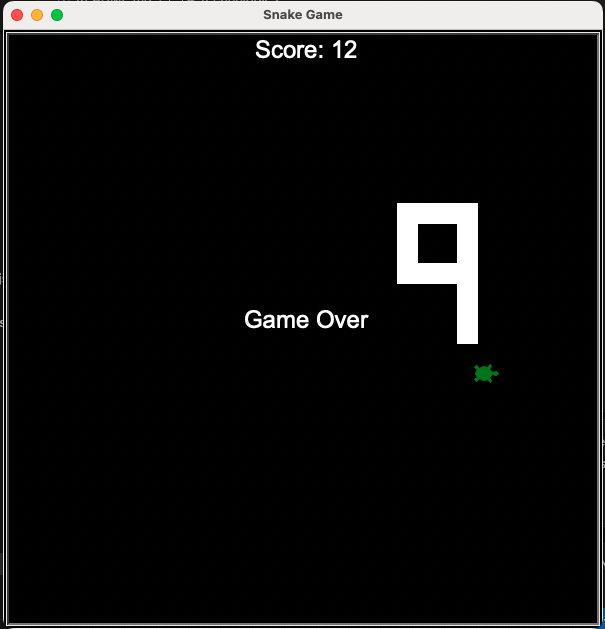

# Snake Game

I built this small game project in Python as part of the 100 Days of Code in Python course. This game allows users to play snake game and record their scores. 

# Technologies

* [Python](https://www.python.org/)

# Minimum Viable Product

- A snake starts in the center of the game window. A turtle serving as food for snake to eat. 
- A scoreboard to record a player's score when a snake eats a turtle.
- Game is over when a snake collides with walls or tails. 

# Screenshots of The Application

